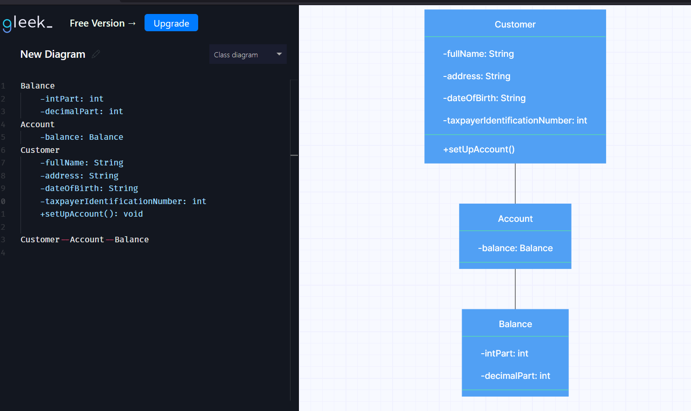
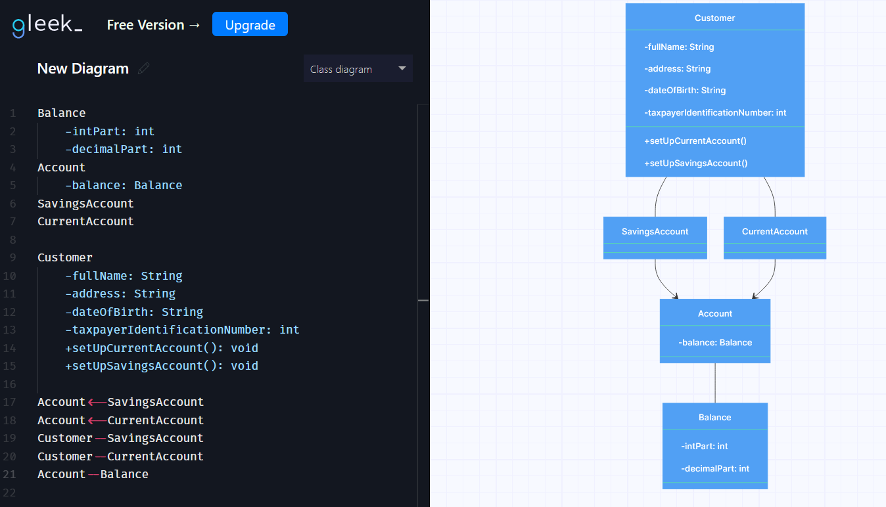

# Bank challenge

## From the user stories below, the domain model will change. The user stories are:


```
1.
As a customer,
So I can safely store use my money,
I want to create a current account.

2.
As a customer,
So I can save for a rainy day,
I want to create a savings account.

3.
As a customer,
So I can keep a record of my finances,
I want to generate bank statements with transaction dates, amounts, and balance at the time of transaction.

4.
As a customer,
So I can use my account,
I want to deposit and withdraw funds.
```
## User story 1

| Class name | Attributes                       | Methods      | Scenarios                           | Outcome                                                                                                          |      
|------------|----------------------------------|--------------|-------------------------------------|------------------------------------------------------------------------------------------------------------------|
| Balance    | int intPart                      |              |                                     |                                                                                                                  |
|            | int decimalPart                  |              |                                     |                                                                                                                  |
|            |                                  |              |                                     |                                                                                                                  |
| Account    | Balance balance                  |              |                                     |                                                                                                                  |
|            |                                  |              |                                     |                                                                                                                  |
| Customer   | Account account                  | setUpAccount | The user wants to create an account | The account attribute is initialized with the users initial deposit. The initial deposit should be more than $5. |
|            | String fullName                  |              |                                     |                                                                                                                  |
|            | String address                   |              |                                     |                                                                                                                  |
|            | String dateOfBirth               |              |                                     |                                                                                                                  |
|            | int taxpayerIdentificationNumber |              |                                     |                                                                                                                  |

### On all classes the getters/setters are implied, except for:
#### The setters for the intPart and decimalPart of the Balance class, and the setters for balance in the Account class
For this user story, the UML diagram is:


## User story 2
### For this user story, we need to create a new class which will be a subclass of Account that is a SavingsAccount. With that in mind, our previous understanding of the account is now changed. Now we should introduce a new Account subclass which will be the CurrentAccount, representing our previous idea of an Account. A user can create both a savings account and a current one. 
#### Now the model looks like this:

| Class name     | Attributes                       | Methods             | Scenarios                                                              | Outcome                                             |      
|----------------|----------------------------------|---------------------|------------------------------------------------------------------------|-----------------------------------------------------|
| Balance        | int intPart                      |                     |                                                                        |                                                     |
|                | int decimalPart                  |                     |                                                                        |                                                     |
|                |                                  |                     |                                                                        |                                                     |
| Account        | Balance balance                  |                     |                                                                        |                                                     |
|                |                                  |                     |                                                                        |                                                     |
| CurrentAccount |                                  |                     |                                                                        |                                                     |
|                |                                  |                     |                                                                        |                                                     |
| SavingsAccount |                                  |                     |                                                                        |                                                     |
|                |                                  |                     |                                                                        |                                                     |
| Customer       | Arraylist<Account> accounts      | setUpCurrentAccount | The user wants to create a current account                             | A new current account is created for the user.      |
|                |                                  | setUpSavingsAccount | The user wants to create a savings account                             | A new savings account is created for the user.      |
|                |                                  | removeNullAccounts  | The user creates an account where the balance is null because of input | The accounts with null in their balance are removed |   
|                | String fullName                  |                     |                                                                        |                                                     |
|                | String address                   |                     |                                                                        |                                                     |
|                | String dateOfBirth               |                     |                                                                        |                                                     |
|                | int taxpayerIdentificationNumber |                     |                                                                        |                                                     |

### On all classes the getters/setters are implied, except for:
#### The setters for the intPart and decimalPart of the Balance class, and the setters for balance in the Account class
##### Note: We could have 2 attributes that are both Account objects, one could be named currentAccount and the other savingsAccount, but implementing inheritance will help down the line when the 2 accounts will inevitably want to use behave differently. 
For this user story, the UML diagram is:



## User story 3 and 4
### For the last 2 user stories for the Core requirements ,a customer will want to print statements for each account in his possession. Consequently, that means that a customer should be able to withdraw and deposit money on each of his accounts. Meaning that these methods will accompany the Account class, and if in the future it is needed, they may override the method of their parent.
#### Now the model looks like this:

| Class name     | Attributes                       | Methods                    | Scenarios                                                                                               | Outcome                                             |      
|----------------|----------------------------------|----------------------------|---------------------------------------------------------------------------------------------------------|-----------------------------------------------------|
| Balance        | int intPart                      | void interact(Balance)     | You want to remove or add to a Balance object                                                           |                                                     |
|                | int decimalPart                  |                            |                                                                                                         |                                                     |
|                |                                  |                            |                                                                                                         |                                                     |
| Account        | Balance balance                  | boolean deposit(Balance)   | The user wants to deposit a valid amount of money(i.e Balance)                                          | Returns true                                        |
|                | String statements                |                            | The user wants to deposit an invalid amount of money                                                    | Returns false                                       |
|                |                                  | boolean withdraw(Balance)  | The user wants to withdraw a valid amount of money(valid Balance and has enough money for the withdraw) | Returns true                                        |
|                |                                  |                            | The user wants to withdraw an invalid amount of money(invalid Balance or does not have enough money     | Returns false                                       |
|                |                                  | void showStatements()      |                                                                                                         |                                                     |
|                |                                  |                            |                                                                                                         |                                                     |
| CurrentAccount |                                  |                            |                                                                                                         |                                                     |
|                |                                  |                            |                                                                                                         |                                                     |
| SavingsAccount |                                  |                            |                                                                                                         |                                                     |
|                |                                  |                            |                                                                                                         |                                                     |
| Customer       | Arraylist<Account> accounts      | void setUpCurrentAccount() | The user wants to create a current account                                                              | A new current account is created for the user.      |
|                |                                  | void setUpSavingsAccount() | The user wants to create a savings account                                                              | A new savings account is created for the user.      |
|                |                                  | void removeNullAccounts()  | The user creates an account where the balance is null because of input                                  | The accounts with null in their balance are removed |   
|                | String fullName                  |                            |                                                                                                         |                                                     |
|                | String address                   |                            |                                                                                                         |                                                     |
|                | String dateOfBirth               |                            |                                                                                                         |                                                     |
|                | int taxpayerIdentificationNumber |                            |                                                                                                         |                                                     |

### On all classes the getters/setters are implied, except for:
#### The setters for the intPart and decimalPart of the Balance class, and the setters for balance in the Account class
##### Note: We could have 2 attributes that are both Account objects, one could be named currentAccount and the other savingsAccount, but implementing inheritance will help down the line when the 2 accounts will inevitably want to use behave differently.
For this user story, the UML diagram is:
