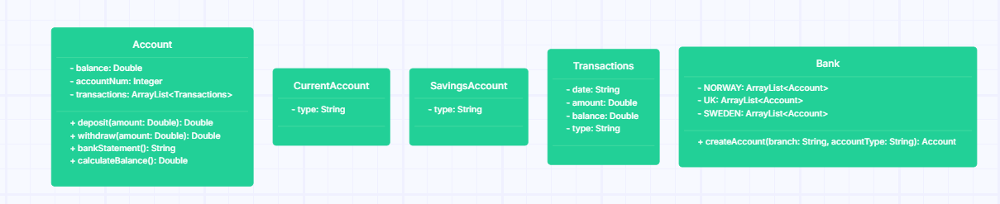

```
As a customer,
So I can safely store and use my money,
I want to create a current account.
```

Bank

| method                                        | object attributes                | context                                                                                                                                                                                               | output/return        |
|-----------------------------------------------|----------------------------------|-------------------------------------------------------------------------------------------------------------------------------------------------------------------------------------------------------|----------------------|
| createAccount(Customer customer, String type) | ArrayList<Customer> customerList | Checks if the customer already exists in the customerList. If exist, create a new account associated with the Customer. If not, create a new Customer, then a new account associated to the Customer. | (Account) newAccount |
|                                               | ArrayList<Account> accountList   |                                                                                                                                                                                                       |                      |


---
```
As a customer,
So I can save for a rainy day,
I want to create a savings account.
```

Bank

| method                                        | object attributes                | context                                                                                                                                                                                               | output/return        |
|-----------------------------------------------|----------------------------------|-------------------------------------------------------------------------------------------------------------------------------------------------------------------------------------------------------|----------------------|
| createAccount(Customer customer, String type) | ArrayList<Customer> customerList | Checks if the customer already exists in the customerList. If exist, create a new account associated with the Customer. If not, create a new Customer, then a new account associated to the Customer. | (Account) newAccount |
|                                               | ArrayList<Account> accountList   |                                                                                                                                                                                                       |                      |


---
```
As a customer,
So I can keep a record of my finances,
I want to generate bank statements with transaction dates, amounts, and balance at the time of transaction.
```

Account

| method                  | object attribute                    | context                                                                                                  | output/return                            |
|-------------------------|-------------------------------------|----------------------------------------------------------------------------------------------------------|------------------------------------------|
| transactionListToString | ArrayList<Transaction> transactions | Each account has a list of transactions. This method iterates over the list, and prints all transactions | (String) allTransactionsFormattedToPrint |


---
```
As a customer,
So I can use my account,
I want to deposit and withdraw funds.
```

Customer

| method                                  | object attributes           | context                                    | output/return       |
|-----------------------------------------|-----------------------------|--------------------------------------------|---------------------|
| deposit(Account account, double amount) | ArrayList<Account> accounts | calls deposit-method on the Account-object | (double) newBalance |

| method                                    | object attributes           | context                                     | output/return       |
|-------------------------------------------|-----------------------------|---------------------------------------------|---------------------|
| withdraw(Account, account, double amount) | ArrayList<Account> accounts | calls withdraw-method on the Account-object | (double) newBalance |

Account

| method                 | object                              | context                                                      | output/return       |
|------------------------|-------------------------------------|--------------------------------------------------------------|---------------------|
| deposit(double amount) | ArrayList<Transaction> transactions | Creates a new Transaction in 'transactions'. Updates balance | (double) newBalance |
|                        | double balance                      |                                                              |                     |


| method                  | object                              | context                                                                                                 | output/return       |
|-------------------------|-------------------------------------|---------------------------------------------------------------------------------------------------------|---------------------|
| withdraw(double amount) | ArrayList<Transaction> transactions | Checks if withdraw is valid. If valid, creates a new Transaction in 'transactions', and updates balance | (double) newBalance |
|                         | double balance                      |                                                                                                         |                     |

