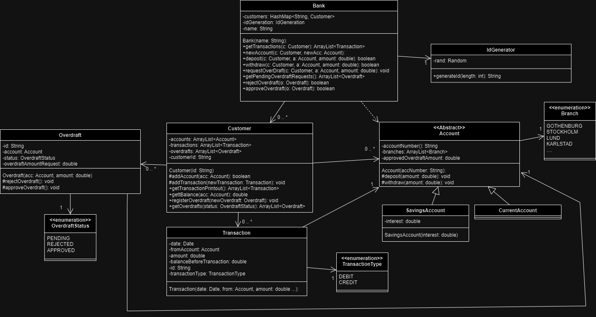

## Class diagram

### Customer class
| Method                                       | Scenario                                            | Output                                                                                                                     |
|----------------------------------------------|-----------------------------------------------------|----------------------------------------------------------------------------------------------------------------------------|
| `openCurrentAccount(String, String): String` | New current account Account name already exists | "Opened a new current account: 'Account.name', at branch: 'branch.name'." "Your already have an account by this name." |
| `openSavingsAccount(String, String): String` | New savings account Account name already exists | "Opened a new savings account: 'Account.name', at branch: 'branch.name'." "Your already have an account by this name." |

### Transaction class
| Method | Scenario | Output |
|--------|----------|--------|
| -      | -        | -      |

### Account class
| Method                            | Scenario                                                          | Output                                                   |
|-----------------------------------|-------------------------------------------------------------------|----------------------------------------------------------|
| `generateBankStatement(): String` | existing transaction no transaction                           | transactions "No account transactions available."    |
| `deposit(float): void`            | -                                                                 | funds are added to account                               |
| `withdraw(float): String`         | enough funds in account not enough funds in account           | "Funds withdrawed from account." "Not enough funds." |
| `getBalance(): float`             | Transaction history is not empty Transaction history is empty | balance 0                                            |

### CurrentAccount extends Account class
| Method | Scenario | Output |
|--------|----------|--------|
| -      | -        | -      |

### SavingsAccount extends Account class
| Method | Scenario | Output |
|--------|----------|--------|
| -      | -        | -      |