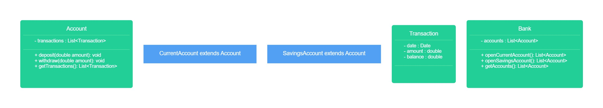

# User Stories

```
As a customer,
So I can safely store and use my money,
I want to create a current account.
```

| Classes | Method               |
|---------|----------------------|
| Bank    | openCurrentAccount() |
|         |                      |


```
As a customer,
So I can save for a rainy day,
I want to create a savings account.
```

| Classes | Methods              |
|---------|----------------------|
| Bank    | openSavingsAccount() |
|         |                      |


```
As a customer,
So I can keep a record of my finances,
I want to generate bank statements with transaction dates, amounts, and balance at the time of transaction.
```

| Classes | Methods           | Scenario                      | Output/Results |
|---------|-------------------|-------------------------------|----------------|
| Account | getTransactions() | If transactions *don't* exist | false          |
|         |                   | If transactions *do* exist    | transactions   |


```
As a customer,
So I can use my account,
I want to deposit and withdraw funds.
```

| Method               | Member variables   | Scenario                                            | Output/Results |
|----------------------|--------------------|-----------------------------------------------------|----------------|
| deposit(int amount)  | int accountBalance | if withdraw amount *is* greater than the balance    | false          |
|                      |                    | if withdraw amount *isn't* greater than the balance | true           |
| withdraw(int amount) |                    |                                                     |                |


## Class diagram

