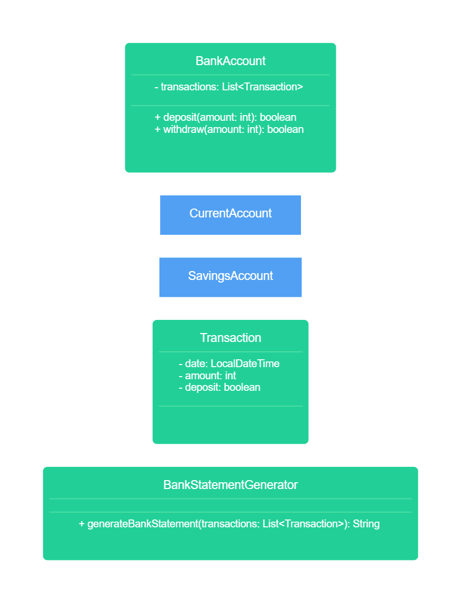

## Core

```
As a customer,
So I can safely store and use my money,
I want to create a current account.
```
```
As a customer,
So I can save for a rainy day,
I want to create a savings account.
```
```
As a customer,
So I can keep a record of my finances,
I want to generate bank statements with transaction dates, amounts, and balance at the time of transaction.
```
```
As a customer,
So I can use my account,
I want to deposit and withdraw funds.
```

### Domain model

| Class                            | Fields                                                     | Methods                                          | Scenario                                 | Output                                                      |
|----------------------------------|------------------------------------------------------------|--------------------------------------------------|------------------------------------------|-------------------------------------------------------------|
| *Account*                        | List<Transaction> transactions                             | void deposit(BigDecimal amount, LocalDate date)  | Customer is making a deposit             |                                                             |
|                                  | List<Transaction> transactions                             | void withdraw(BigDecimal amount, LocalDate date) | Customer is making a withdrawal          |                                                             |
|                                  |                                                            |                                                  | When customer does not have enough money | Throw an exception                                          |
|                                  | List<Transaction> transactions                             | BigDecimal getBalance()                          | Customer checks their balance            | Current balance                                             |
| CurrentAccount extends *Account* |                                                            |                                                  |                                          |                                                             |
| SavingAccount extends *Account*  | BigDecimal interestRate<br/>List<Transaction> transactions | void addInterests(LocalDate date)                | Banking system adds interests to account |                                                             |
| BankStatement                    | Account account                                            | String print()                                   | Customer requests bank statement         | String representation of all transactions in a table format |
| Transaction                      |                                                            |                                                  |                                          |                                                             |

### Class diagram


## Extensions

```
As an engineer,
So I don't need to keep track of state,
I want account balances to be calculated based on transaction history instead of stored in memory.
```

*^ Already covered in core*

```
As a bank manager,
So I can expand,
I want accounts to be associated with specific branches.
```
```
As a customer,
So I have an emergency fund,
I want to be able to request an overdraft on my account.
```
```
As a bank manager,
So I can safeguard our funds,
I want to approve or reject overdraft requests.
```
```
As a customer,
So I can stay up to date,
I want statements to be sent as messages to my phone.
```

### Domain model (extending core)

| Class                                  | Fields                               | Methods                                          | Scenario                                                          | Output             |
|----------------------------------------|--------------------------------------|--------------------------------------------------|-------------------------------------------------------------------|--------------------|
| *Account*                              | BankBranch bankBranch                |                                                  | When creating account it needs to have bank branch associated     |                    |
| CurrentAccount extends *Account*       | Overdraft overdraft                  | void requestOverdraft(Overdraft overdraft)       | Customer requests overdraft                                       |                    |
| BankBranch                             | List<Account> accounts               | void addAccount(Account account)                 | Add account to the branch when creating                           |                    |
|                                        |                                      |                                                  | If account is not assigned to this branch                         | Throw an exception |
|                                        |                                      |                                                  | If account has been already added to this branch                  | Do nothing         |
| Overdraft                              | boolean pending<br/>boolean approved | void approve()                                   | Manager approves overdraft                                        |                    |
|                                        | boolean pending<br/>boolean approved | void reject()                                    | Manager rejects overdraft                                         |                    |
| BankStatement                          | SmsService smsService                | void sendStatement(String phoneNumber)           | Customer requests bank statement to be delivered via SMS          |                    |
| *SmsService*                           |                                      | void sendSms(String phoneNumber, String message) | Sends an SMS                                                      |                    |
|                                        |                                      |                                                  | If SMS cannot be sent                                             | Throw an exception |
| TwilioService implements *SmsService*  |                                      |                                                  | Uses Twilio as SMS backend                                        |                    |
| MockSmsService implements *SmsService* |                                      |                                                  | Mocks sending SMS by outputting them to stdout (used for testing) |                    |

### Class diagram
