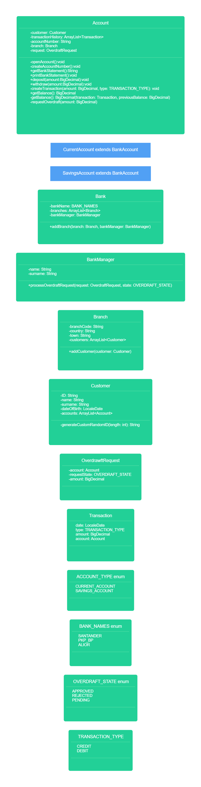

# Domain model Bank challenge
## Core
```
As a customer,
So I can safely store and use my money,
I want to create a current account.
```
#### Create CurrentAccount and Customer classes
| CurrentAccount     |
|--------------------|
| accountId: String  |
| customer: Customer |
| balance: double    |

| Customer            |
|---------------------|
| customerId: String  |
| name: String        |
| phoneNumber: String |
| email: String       |

```
As a customer,
So I can save for a rainy day,
I want to create a savings account.
```

#### Create Account class and make Current- and SavingsAccount inherit from this
| Account            |
|--------------------|
| accountId: String  |
| customer: Customer |
| balance: double    |

| CurrentAccount |
|----------------|
| super(Account) |

| SavingsAccount |
|----------------|
| super(Account) |

```
As a customer,
So I can keep a record of my finances,
I want to generate bank statements with transaction dates, amounts, and balance at the time of transaction.
```
#### Create Transaction class and add a Transaction list to Account. Then create getBankStatement() class in Account
| Transaction    |
|----------------|
| Date date      |
| double amount  |
| double balance |

| Account                         |
|---------------------------------|
| accountId: String               |
| customer: Customer              |
| balance: double                 |
| transactions: List<Transaction> |

| Class   | Method             | Variables                      | Scenario                                                                                    | Return                        |
|---------|--------------------|--------------------------------|---------------------------------------------------------------------------------------------|-------------------------------|
| Account | getBankStatement() | List<Transaction> transactions | The transaction history is blank                                                            | Return "No transactions"      |
|         |                    |                                | There are transactions in the list. The transactions are built into a nice organized String | Return String of transactions |
```
As a customer,
So I can use my account,
I want to deposit and withdraw funds.
```
| Class   | Method                  | Variables       | Scenario                                                                                                   | Return                                                                     |
|---------|-------------------------|-----------------|------------------------------------------------------------------------------------------------------------|----------------------------------------------------------------------------|
| Account | withdraw(double amount) | balance: double | The amount of money being withdrawn is larger than the balance                                             | Return "Withdraw failed. Amount withdrawn is more than balance in account" |
|         |                         |                 | The amount of money withdrawn is lower than balance, transaction successful and added to transactions list | Return "Withdraw successful. $(amount) has been withdrawn."                |
| Account | deposit(double amount)  | balance: double | The amount of money deposited to the account, transaction added to transactions list                       | Return "$(amount) deposited"                                               |
|         |                         |                 |                                                                                                            |                                                                            |
| Account | Both                    | balance: double | The amount is set to a negative number. Transaction fails                                                  | Return "The amount cannot be a negative number"                            |


## Class Diagram Core

```
Customer
	- customerId: String
	- name: String
	- phoneNumber: String
	- email: String
Account
	- accountId: String
	- customer: Customer
	- balance: double
	- transactions: List<Transaction>
	+ getBankStatement() String
	+ withdraw(amount: double) String
	+ deposit(amount: double) String
CurrentAccount
	- super(Account)
SavingsAccount
	- super(Account)
Transaction
	- date: Date
	- amount: double
	- balance: double
TransactionType (enum)
    - Deposit
    - Withdraw
    + toString() String
```

## Extension
```
As an engineer,
So I don't need to keep track of state,
I want account balances to be calculated based on transaction history instead of stored in memory.
```
| Account                         |
|---------------------------------|
| accountId: String               |
| customer: Customer              |
| transactions: List<Transaction> |

| Class   | Method       | Variables                      | Scenario                                                                                                                   | Return                |
|---------|--------------|--------------------------------|----------------------------------------------------------------------------------------------------------------------------|-----------------------|
| Account | getBalance() | List<Transaction> transactions | The transaction history is blank                                                                                           | Return 0.0            |
|         |              |                                | There are numerous transactions. The deposits are added to while the withdraws are subtracted from balance to be returned. | Return double balance |

```
As a bank manager,
So I can expand,
I want accounts to be associated with specific branches.
```
| Branch           |
|------------------|
| branchId: String |
| name: String     |
| location: String |

| Account                         |
|---------------------------------|
| accountId: String               |
| customer: Customer              |
| branch: Branch                  |
| transactions: List<Transaction> |
```
As a customer,
So I have an emergency fund,
I want to be able to request an overdraft on my account.

Assumption: An account can only have one active overdraft request at a time
```
| Branch                                  |
|-----------------------------------------|
| branchId: String                        |
| name: String                            |
| location: String                        |
| overdraftRequests: Map<Account, Double> |

| Class          | Method                                              | Variables                               | Scenario                                                                                            | Return                                           |
|----------------|-----------------------------------------------------|-----------------------------------------|-----------------------------------------------------------------------------------------------------|--------------------------------------------------|
| Account        | requestOverdraft(double amount)                     | Branch branch                           | Negative overdraft is requested                                                                     | Return "Amount cannot be negative"               |
|                |                                                     |                                         | A positive number is put in as requested value. Calls addOverdraftRequest method on accounts branch | Return "Overdraft of $(amount) requested"        |
| Branch         | addOverdraftRequest(Account account, double amount) | overdraftRequests: Map<Account, Double> | account reference is put as key while the value is set as the amount requested for.                 | Return void                                      |
| SavingsAccount | requestOverdraft(double amount)                     |                                         | Overdraft requested on SavingsAccount object                                                        | Return "You can not overdraft a savings account" |

```
As a bank manager,
So I can safeguard our funds,
I want to approve or reject overdraft requests.
```
| Account                         |
|---------------------------------|
| accountId: String               |
| customer: Customer              |
| branch: Branch                  |
| transactions: List<Transaction> |
| overdraftLimit: double          |


| Class          | Method                                                    | Variables                               | Scenario                                                                                                     | Return                                            |
|----------------|-----------------------------------------------------------|-----------------------------------------|--------------------------------------------------------------------------------------------------------------|---------------------------------------------------|
| Account        | setOverdraftLimit(double limit)                           | overdraftLimit: double                  | The limit set is negative, overdraftLimit remains unchanged                                                  | Return void                                       |
|                |                                                           |                                         | The limit is a positive number, overdraftLimit is set to the limit                                           | Return void                                       |
| SavingsAccount | setOverdraftLimit(double limit)                           | overdraftLimit: double                  | A savings account tries to set overdraftLimit, it remains unchanged.                                         | Return void                                       |
| Branch         | reviewOverdraftRequest(String accountId, boolean approve) | overdraftRequests: Map<Account, Double> | An accountId without an active request entered                                                               | Return "No request found"                         |
|                |                                                           |                                         | An account with a request is declined                                                                        | Return "Request for account (accountId) declined" |
|                |                                                           |                                         | An account with a request is accepted. setOverdraftLimit is called on the account with the amount requested. | Return "Request for account (accountId) accepted" |

## Class diagram Extension

```
Branch
	- branchId: String
	- name: String
	- location: String
	- overdraftRequests: Map<Account, Double>
	+ addOverdraftRequest(account: Account, amount: double)
	+ reviewOverdraftRequest(String accountId, boolean approve) String
Customer
	- customerId: String
	- name: String
	- phoneNumber: String
	- email: String
Account
	- accountId: String
	- customer: Customer
	- Branch branch
	- transactions: List<Transaction>
	- overdraftLimit: double
	+ getBankStatement() String
	+ withdraw(amount: double) String
	+ deposit(amount: double) String
	+ getBalance() double
	+ requestOverdraft(amount: double) String
	+ setOverdraftLimit(amount: double)
CurrentAccount
	- super(Account)
SavingsAccount
	- super(Account)
	- requestOverdraft(amount: double) String
	- setOverdraftLimit(amount: double)
Transaction
	- date: Date
	- amount: double
	- balance: double
TransactionType (enum)
	- Deposit
	- Withdraw
	+ toString() String
```


```
As a customer,
So I can stay up to date,
I want statements to be sent as messages to my phone.
```
#### Twilio

| Class   | Method              | Variables         | Scenario                                                                                                             | Return |
|---------|---------------------|-------------------|----------------------------------------------------------------------------------------------------------------------|--------|
| Account | sendBankStatement() | Customer customer | SendBankStatement called, customers phonenumber found in customer class, getBankStatement String sent to phonenumber | Void   |
|         |                     | transactions      |                                                                                                                      |        |
